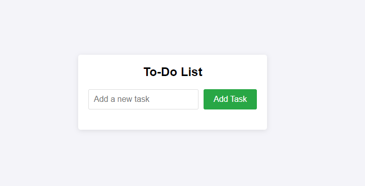

# Taskify
<h1>To-Do List Application</h1> 
This project is a simple To-Do List application that allows users to add, view, and manage tasks. It leverages HTML, CSS, JavaScript, and PHP to provide a complete solution from the user interface to the server-side logic for data persistence.
 <h2>Features</h2> <ul> <li><strong>Add Tasks:</strong> Users can add new tasks to their to-do list through a simple form.</li> <li><strong>View Tasks:</strong> The list of tasks is dynamically displayed on the page, updated with each addition.</li> <li><strong>Persist Tasks:</strong> Tasks are saved on the server using PHP and stored in a text file, allowing tasks to persist even after refreshing the page.</li> </ul> <h2>Project Structure</h2> <ul> <li><strong>index.html:</strong> Contains the HTML structure and elements for the To-Do List application.</li> <li><strong>style.css:</strong> Provides styling for the HTML elements to make the application visually appealing.</li> <li><strong>script.js:</strong> Handles client-side logic such as fetching, adding, and displaying tasks.</li> <li><strong>tasks.php:</strong> Manages server-side logic to save and retrieve tasks from a file.</li> <li><strong>tasks.txt:</strong> A text file used to store the tasks.</li> </ul> <h2>Technologies Used</h2> <ul> <li><strong>HTML:</strong> Provides the basic structure of the application, including a form for adding tasks and a list to display them.</li> <li><strong>CSS:</strong> Styles the application, making it user-friendly and visually appealing.</li> <li><strong>JavaScript:</strong> Handles the dynamic behavior of the application, such as adding tasks to the list and fetching tasks from the server.</li> <li><strong>PHP:</strong> Manages server-side operations, including saving new tasks to a file and retrieving existing tasks.</li> </ul> <h2>How It Works</h2> <h3>Frontend (HTML, CSS, JavaScript)</h3> <ul> <li>The user interacts with the application through a form in <code>index.html</code>.</li> <li>When a new task is added via the form, JavaScript captures the input and sends it to the server using a POST request.</li> <li>JavaScript also handles displaying the tasks dynamically on the web page by manipulating the DOM.</li> </ul> <h3>Backend (PHP)</h3> <ul> <li>The <code>tasks.php</code> script handles incoming requests from the frontend.</li> <li>For a GET request, it reads the tasks from <code>tasks.txt</code> and returns them as a JSON response.</li> <li>For a POST request, it appends the new task to <code>tasks.txt</code> and returns a success status.</li> </ul> <h3>Data Storage</h3> <ul> <li>Tasks are stored in a plain text file (<code>tasks.txt</code>), with each task on a new line. This simple approach ensures that tasks are persisted across sessions.</li> </ul> <h2>Example Use Case</h2> <ul> <li>The user opens the To-Do List application in their browser.</li> <li>The user sees an input field and a button to add tasks.</li> <li>The user types a task into the input field and clicks the "Add Task" button.</li> <li>The task is sent to the server via a POST request.</li> <li>The server saves the task to <code>tasks.txt</code> and responds with a success message.</li> <li>The task is then displayed in the list on the webpage.</li> <li>When the user refreshes the page, a GET request retrieves all tasks from the server and displays them.</li> </ul> </body> </html>
<h1>
This is How it Looks
</h1>

<!-- LICENSE -->
<h2>License</h2>
Distributed under the MIT License. Click [https://github.com/krsakshi/Taskify/blob/main/LICENSE.md] for more information.
